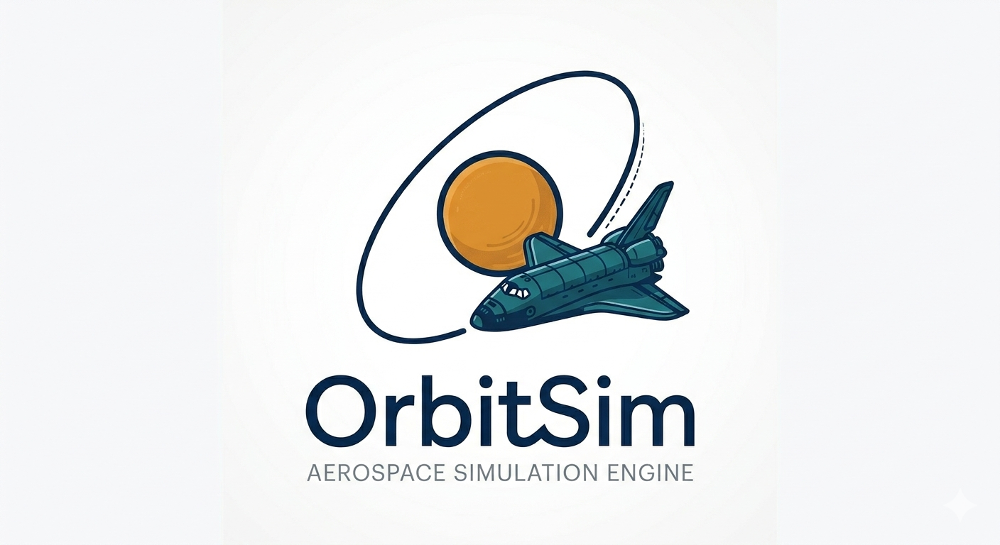

# OrbitSim

<div align="center">

  

  **A Real-Physics Aerospace Simulation — Phase 1 Complete**

  [](https://opensource.org/licenses/MIT)
  [](https://en.cppreference.com/w/cpp/20)
  [](https://github.com/Krio18/OrbitSim)

  *Orbits that emerge from real gravity, not scripted paths*

</div>

---

## What is OrbitSim?

OrbitSim is a **C++ aerospace simulation engine** in the spirit of Kerbal Space Program — but built on real physics. A solar system is assembled from real parameters (masses, gravitational parameters, orbital elements), and a spacecraft feels the summed gravity of every body at all times. It falls, inevitably — *unless* it has the right lateral velocity, in which case a stable orbit emerges on its own. Nothing about the orbit is scripted: it falls out of integrating the forces.

The simulation core is fully decoupled from rendering, runs at a deterministic fixed timestep, and uses a symplectic integrator so orbits stay closed indefinitely instead of drifting.

---

## Core Idea

> **An orbit is just falling and missing the ground** — falling sideways fast enough that you keep missing.

- **Too slow** → the vessel falls back and crashes
- **Right speed** → it traces a stable, closed orbit
- **Too fast** → it escapes

Everything else in the simulation is layered on top of this single emergent behavior.

---

## Demo

https://github.com/user-attachments/assets/0d75d769-aca2-4c29-b8cc-3b21059d8052

> Phase 1 — orbite LEO stable à 7 000 km. Euler semi-implicite (rouge) dérive progressivement, Velocity Verlet (vert) reste fermé indéfiniment. Warp ×4000 par défaut.

---

## Current State

| Phase | Description | Status |
|-------|-------------|--------|
| Phase 0 | Core Simulation Architecture (State, fixed-timestep loop, TimeManager, Integrators) | ✅ Done |
| Phase 1 | First Orbit Milestone — gravité réelle, orbite 2D stable, conservation, rendu SDL2 | ✅ Done |
| Phase 2 | N-body Gravity & Multi-body (summed gravity, hybrid model, collisions) | 📋 Planned |
| Phase 3 | Celestial Bodies & Solar System (Keplerian rails, SOI, data-driven) | 📋 Planned |
| Phase 4 | Coordinate Frames & Precision (float64, floating origin) | 📋 Planned |
| Phase 5 | The Vessel (6DOF rigid body, variable mass, propulsion, staging) | 📋 Planned |
| Phase 6 | Atmospheres (multi-layer, composition-driven) | 📋 Planned |
| Phase 7 | Aerodynamics (drag, dynamic pressure, reentry) | 📋 Planned |
| Phase 8 | Guidance, Navigation & Control (PID, powered descent/landing) | 📋 Planned |
| Phase 9 | Orbital Mechanics & Trajectory Prediction (patched conics, maneuver nodes) | 📋 Planned |
| Phase 10 | Time Warp (analytic on-rails propagation) | 📋 Planned |
| Phase 11 | Rendering & Visualization (map/flight view, orbit lines, HUD) | 📋 Planned |
| Phase 12 | Sandbox & Editor Tools (vessel builder, debug viz, scenarios) | 📋 Planned |

---

## Quick Start

### Prerequisites

- **CMake** 3.21 or higher
- **C++20** compatible compiler (GCC 11+ · Clang 13+ · MSVC 19.29+)
- **vcpkg** package manager

### Installation

#### 1. Install vcpkg (if not already installed)

**Linux/macOS:**
```bash
git clone https://github.com/microsoft/vcpkg.git
cd vcpkg
./bootstrap-vcpkg.sh
export VCPKG_ROOT=$(pwd)   # add to ~/.bashrc or ~/.zshrc to persist
```

**Windows (PowerShell):**
```powershell
git clone https://github.com/microsoft/vcpkg.git
cd vcpkg
.\bootstrap-vcpkg.bat
$env:VCPKG_ROOT = $PWD
```

#### 2. Clone OrbitSim

```bash
git clone https://github.com/Krio18/OrbitSim.git
cd OrbitSim
```

#### 3. Install dependencies

```bash
vcpkg install glm sdl2
```

> `sdl2` est requis pour le rendu (Phase 1+). `nlohmann-json` et `gtest` sont optionnels — le build averti si absent et désactive les fonctionnalités correspondantes.

#### 4. Build

**Release (Linux/macOS):**
```bash
cmake -B build -DCMAKE_BUILD_TYPE=Release
cmake --build build --parallel
```

**Debug (Linux/macOS):**
```bash
cmake -B build -DCMAKE_BUILD_TYPE=Debug
cmake --build build --parallel
```

**Windows (PowerShell):**
```powershell
cmake -B build -DCMAKE_BUILD_TYPE=Release
cmake --build build
```

#### 5. Run

**Linux/macOS:**
```bash
./build/bin/OrbitSim
```

**Windows:**
```powershell
.\build\bin\OrbitSim.exe
```

#### Optional build flags

| Flag | Default | Description |
|------|---------|-------------|
| `-DORBIT_BUILD_TESTS=ON` | ON | Build unit tests (requires GTest) |
| `-DORBIT_ENABLE_ASAN=ON` | OFF | Enable AddressSanitizer (Debug only) |

---

## Technology Stack

| Component | Library | Status |
|-----------|---------|--------|
| **Build System** | CMake + vcpkg | ✅ Active |
| **Math** | GLM (`dvec3` / `dquat`, double precision) | ✅ Active (Phase 0) |
| **Data** | nlohmann-json (data-driven bodies & atmospheres) | 📋 Phase 3 |
| **Testing** | Google Test | 📋 Phase 2+ |
| **Windowing/Rendering 2D** | SDL2 | ✅ Active (Phase 1) |
| **Rendering** | bgfx | 📋 Phase 11 |
| **HUD / Debug UI** | Dear ImGui | 📋 Phase 11 |
| **Profiling** | Tracy | 🔧 Optional |

---

## Architecture

**Design Principles:**
- **Deterministic fixed-timestep core** — physics advances in fixed `dt` chunks, fully decoupled from the render framerate. Same inputs → same outputs, always.
- **Double precision everywhere** — all physics state in `float64`. Solar-system distances (~10¹¹ m) destroy `float32`.
- **Symplectic integration** — velocity Verlet / leapfrog conserve energy over the long term, so orbits stay closed instead of spiraling.
- **Hybrid gravity model** — celestial bodies follow analytic Keplerian orbits (on rails); the vessel feels the summed gravity of every body. Emergent orbits and Lagrange points, with a stable solar system.
- **Data-driven bodies** — masses, radii, orbital elements and atmospheric composition loaded from files, never hardcoded.
- **Sim core ≠ rendering** — the physics engine knows nothing about rendering and can be tested headless.
- **Shared patterns with VoxelEngine** — ServiceLocator, fixed-timestep loop, manager lifecycle, RAII, GLM.

---

## Validation Philosophy

A simulation can show beautiful trajectories and still be completely wrong. OrbitSim validates against analytic ground truths from day one:

- Free fall (no atmosphere) matches the exact parabola
- Orbital period matches `T = 2π√(a³/μ)`
- Specific orbital energy `ε = v²/2 − μ/r` stays constant
- Angular momentum `h = r × v` stays constant
- Vis-viva `v² = μ(2/r − 1/a)` holds everywhere on the orbit
- Powered Δv matches Tsiolkovsky: `Δv = Isp·g0·ln(m₀/m₁)`

---

## License

This project is licensed under the MIT License - see the [LICENSE](LICENSE) file for details.

---

## Acknowledgments

- [GLM](https://github.com/g-truc/glm) by G-Truc - Math, with double-precision vectors and quaternions
- [SDL2](https://www.libsdl.org/) (planned) - Cross-platform windowing
- [bgfx](https://github.com/bkaradzic/bgfx) (planned) by Branimir Karadzic - Rendering abstraction
- [nlohmann/json](https://github.com/nlohmann/json) (planned) - Data-driven configuration
- [Dear ImGui](https://github.com/ocornut/imgui) (planned) by Omar Cornut - Debug UI and HUD
- The orbital mechanics community and the [Orbiter](http://orbit.medphys.ucl.ac.uk/) simulator for hard-won implementation lessons